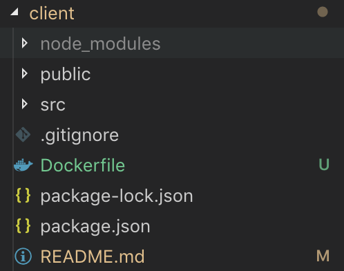

# create-react-app

Local에 react 프로젝트를 설치한다.

```bash
$ npx create-react-app client
```

Dockerfile을 생성한다.

```bash
$ cd client
$ touch Dockerfile
```

# tree



# Dockerfile

docker hub에서 image를 불러오는 것이 아니라, 자신이 직접 작성하는 것

```Dockerfile
FROM node:10.15-alpine

EXPOSE 3000

WORKDIR /app

# /app 위에 package.json 및 package-lock.json file을 copy
COPY package.json package-lock.json* ./

RUN npm install && npm cache clean --force

# souce copy
# /app 위에 client(자기자신) 전부 복사해서 넣는다.
COPY . .

CMD ["npm","run","start"]
```

> alpine은 추후에 exec로 container 내부에 접속할때 /bin/sh로 접속해야한다.

<hr/>

# Build

Dockerfile 빌드하기

```bash
$ docker build -it client .
```

> client는 자신이 Naming하는 build될 Image Name이다.
> <br>
> 반드시 . 을 입력해야함

<hr/>

# Run

container로 build된 Dockerfile image 실행하기
<br>
**client** : 이전 build에서 생성된 image name

## 예제 1

기본적인 Run

```bash
$ docker run -it -d client
```

## 예제 2

생성될 container name을 clientContainer로 지어줌

```bash
$ docker run -it --name clientContainer -d client
```

## 예제 3

-p 3000(로컬에서 접속할때의 포트):3000(dockerfile에서 EXPOSE한 포트)

```bash
$ docker run -it --name clientContainer -d -p 3000:3000 client
```

## 예제 4

-v ./:/app
<br>
**./** : Dockerfile이 위치한 path
<br>
**/app** : Docker Container 내부에 위치한 path
<br>
**/app/node_modules** : 노드모듈 데이터는 뺀다 !

```bash
$ docker run -it --name clientContainer -d -p 3000:3000 -v ./:/app /app/node_modules client
```

## 여러가지 option

| 옵션   | 설명                                                        | 사용예제                               |
| ------ | ----------------------------------------------------------- | -------------------------------------- |
| -d     | 보통 데몬 모드라고 부르며 컨테이너가 백그라운드로 실행된다. | -d                                     |
| -p     | 호스트와 컨테이너의 포트를 연결                             | -p 3000:3000                           |
| -v     | 호스트와 컨테이너의 디렉토리를 연결 (마운트)                | -v ./client/:/app -v /app/node_modules    |
| -e     | 컨테이너 내에서 사용할 환경변수 설정                        | -e MYSQL_ROOT_PASSWORD=examplepassword |
| –-name | 컨테이너 이름 설정                                          | --name jonsoku                         |
| -–rm   | 프로세스 종료시 컨테이너 자동 제거                          | --rm                                   |
| -it    | -i와 -t를 동시에 사용한 것으로 터미널 입력을 위한 옵션      | -it                                    |
| –-link | 컨테이너 연결 [컨테이너명:별칭]                             | --link=”db:db”                         |

<hr/>

# 실행해보기

http://localhost:3000
