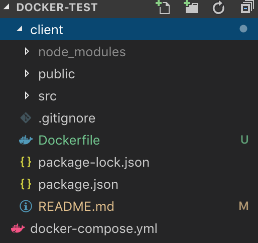

# create-react-app

Local에 react 프로젝트를 설치한다.

```bash
$ mkdir docker-test
$ cd docker-test
$ npx create-react-app client
```

Dockerfile 을 생성한다.

```bash
$ cd client
$ touch Dockerfile
```

docker-compose.yml을 생성한다

```bash
$ cd ..
$ touch docker-compose.yml
```

# tree



# Dockerfile

docker hub에서 image를 불러오는 것이 아니라, 자신이 직접 작성하는 것

```Dockerfile
FROM node:10.15-alpine

EXPOSE 3000

WORKDIR /app

# /app 위에 package.json 및 package-lock.json file을 copy
COPY package.json package-lock.json* ./

RUN npm install && npm cache clean --force

# souce copy
# /app 위에 client(자기자신) 전부 복사해서 넣는다.
COPY . .

CMD ["npm","run","start"]
```

> alpine은 추후에 exec로 container 내부에 접속할때 /bin/sh로 접속해야한다.

<hr/>

# docker-compsoe.yml

```yml
version: "2"
services:
  client:
    build:
      dockerfile: Dockerfile
      context: ./client
    volumes:
      - ./client/:/app
      - /app/node_modules
    ports:
      - "3000:3000"
```

# docker-compse up

```bash
$ cd /docker-test
$ docker-compose up
```

# 실행해보기

http://localhost:3000
